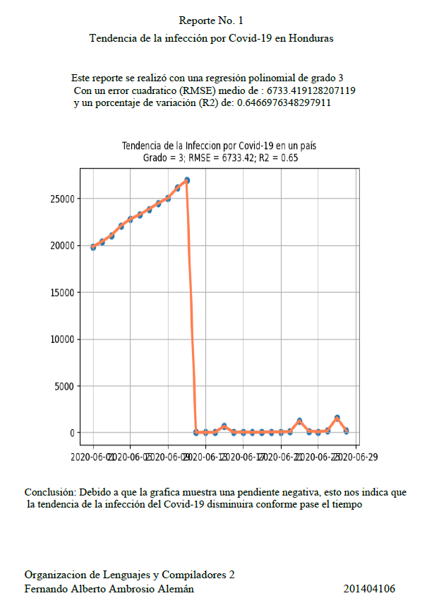
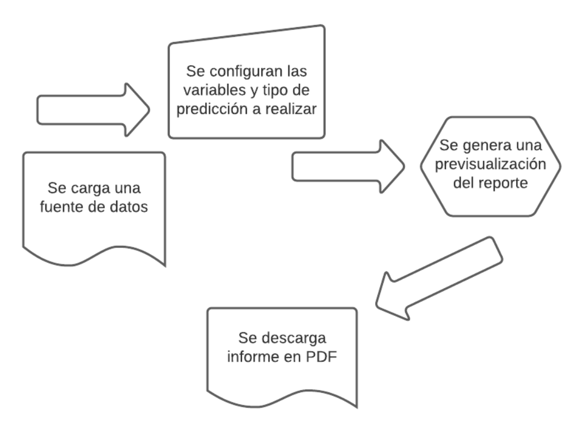
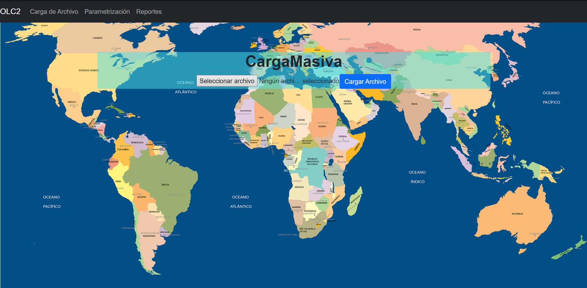
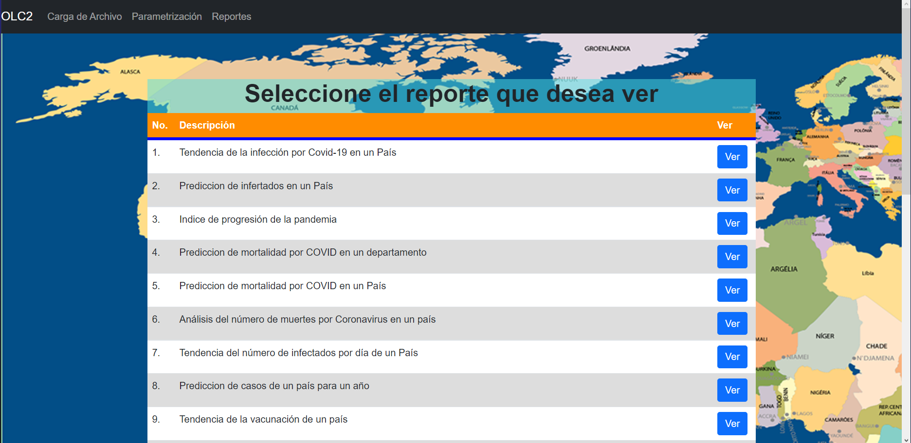
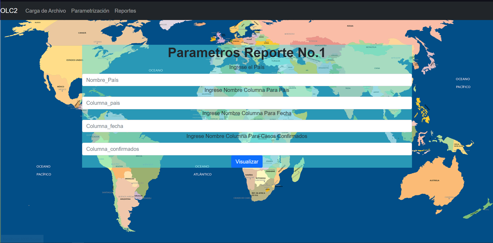
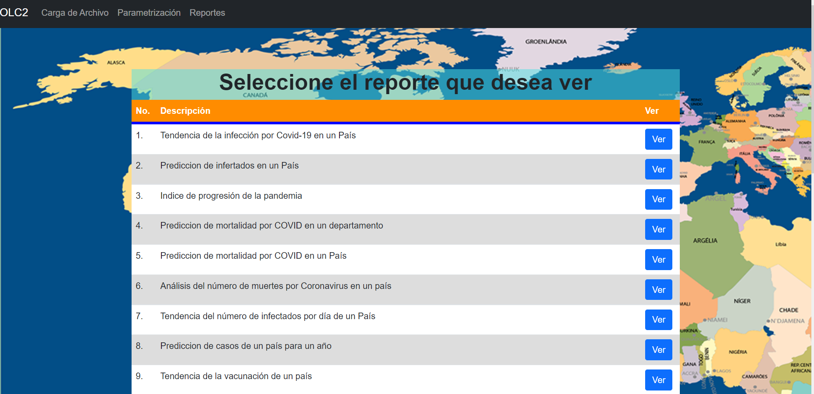
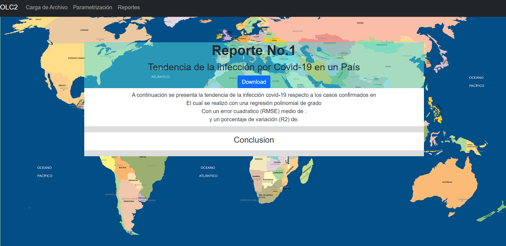

# 
Universida de San Carlos de Guatemala

## 
Facultad de ingenieria

## 
Escuela de Ciencias

## 
Organización de Lenguajes y Compiladores 2

## 
Sección A

#### 
Proyecto 2

### 
Fernando Alberto Ambrosio Alemán

### 
201404106

#### 
Coronavirus Data Analysis With Machine Learning

### 
Manual Técnico

#### Vision General:
- 
 Debido a la pandemia del Covid-19 que ha estado afectando a todo el mundo de manera negativa por muchos factores, entre los que podemos mencionar de manera económica y de manera social ya que esta enfermedad ha hecho que todas las personas tengan que aislarse en sus hogares para de alguna manera poder evitar asi los contagios entre sus seres queridos y que estos no sufran las consecuencias de la enfermedad, es por esto que grandes empresas desde el inicio de la pandemia se han dedicado a la recolección de datos y generación de estadisticas correspondientes a esta enfermedad, para de alguna manera con la ayuda de herramientas de software poder generar ciertas predicciones o graficas que nos puedan dar un panorama detallado de como ha sido la evolución de la pandemia en el mundo. Es por esto que fue solicitado el desarrollo de esta aplicación la cual nos permite generar ciertos reportes con información especifica para poder tener una idea de la pandemia en casos especificos

#### Objetivos:
1. Crear una pagina web básica, alojada en cualquier servicio para la cual pueda ser accesible desde cualquier lugar
2. Aprender y saber desarrollar lo necesario para la creación de las gráficas necesarias 
3. Construir la aplicación para el analisis de los datos con las herramientas de Python

#### Especificaciones:
Lenguajes y Herramientas utilizadas para el desarrrollo del proyecto-
- 
 Para la creación del servicio backend de la aplicación se hizo uso de Python con la librería flask la cual nos permite levantar un servidor con el cual nuestra aplicación estara comunicando para poder mostrar las consultas a los reportes solicitados

- 
 Para la parte del front end se utilizó la herramienta de React para poder crear cada uno de los formularios y las vistas para los reportes generados

- 
 Se utilizó una instancia de maquina virtual para poder levantar los servicios de nuestra aplicación, tanto la página web como el servidor desarrollado en python

#### Requisitos del sistema:

 Requerimientos de Hardware 

- 
 Equipo, Teclado, Mouse, Monitor

- 
 Tarjeta de Red LAN y/o Wireless

- 
 Procesador

 Requerimientos de Software 

- 
 Sistema Operativo a eleccion

- 
 Conexión internet local

### Herramientas Utilizadas
- Python 
    - 
 Python es un lenguaje de programación interpretado cuya filosofía hace hincapié en la legibilidad de su código.​ Se trata de un lenguaje de programación multiparadigma, ya que soporta parcialmente la orientación a objetos, programación imperativa y, en menor medida, programación funcional.<a href=https://www.python.org>Python</a>
    

- Flask 
    - 
 Flask es un framework minimalista escrito en Python que permite crear aplicaciones web rápidamente y con un mínimo número de líneas de código. Está basado en la especificación WSGI de Werkzeug y el motor de templates Jinja2 y tiene una licencia BSD. <a href=https://flask.palletsprojects.com/en/2.0.x>Python</a>
    

- JavaScript
    - 
 Es un lenguaje de programación interpretado, dialecto del estándar ECMAScript. Se define como orientado a objetos, basado en prototipos, imperativo, débilmente tipado y dinámico. Se utiliza principalmente del lado del cliente, implementado como parte de un navegador web permitiendo mejoras en la interfaz de usuario y páginas web dinámicas y JavaScript del lado del servidor (Server-side JavaScript o SSJS). Su uso en aplicaciones externas a la web, por ejemplo en documentos PDF, aplicaciones de escritorio (mayoritariamente widgets) es también significativo. JavaScript se diseñó con una sintaxis similar a C, aunque adopta nombres y convenciones del lenguaje de programación Java. Sin embargo, Java y JavaScript tienen semánticas y propósitos diferentes. Su relación es puramente comercial, tras la compra del creador de Java (Sun Microsystems) de Nestcape Navigator (creador de LiveScript) y el cambio de nombre del lenguaje de programación. <a href=https://www.javascript.com>JavaScript</a>
    

- React
    - 
 es una biblioteca Javascript de código abierto diseñada para crear interfaces de usuario con el objetivo de facilitar el desarrollo de aplicaciones en una sola página. Es mantenido por Facebook y la comunidad de software libre. En el proyecto hay más de mil desarrolladores libres. React te ayuda a crear interfaces de usuario interactivas de forma sencilla. Diseña vistas simples para cada estado en tu aplicación, y React se encargará de actualizar y renderizar de manera eficiente los componentes correctos cuando los datos cambien.Las vistas declarativas hacen que tu código sea más predecible, por lo tanto, fácil de depurar <a href=https://es.reactjs.org>React</a>
    

- Visual Code
    - 
  es un editor de código fuente que permite trabajar con diversos lenguajes de programación, admite gestionar tus propios atajos de teclado y refactorizar el código. Es gratuito, de código abierto y nos proporciona una utilidad para descargar y gestionar extensiones con las que podemos personalizar y potenciar esta herramienta. Las extensiones de Visual Studio Code nos otorgan infinidad de opciones, como colorear tabulaciones, etiquetas o recomendaciones de autocompletado. También hay extensiones que nos ayudan con el lenguaje de programación que vayamos a usar, como por ejemplo para Python, C / C++, JavaScript, etc. <a href=https://code.visualstudio.com>Visual Code</a>
    

###Requisitos Previos
- 
  Los requisistos previos para iniciar el proyecto serán instalar y descargar algunas herramientas que les ayudarán con el desarrollo del proyecto, el sistema operativo queda a su discreción.

1. Instalar JavaScript:

	- Descarguen e instalen JavaScript, agregarlo a sus variables de entorno para no tener inconvenientes.

2. Instalación de python, en caso no lo tuviesen instalado
	- Ademas es necesario instalar las librerias que se requieren para este proyecto.
		- Matplotlib
		- pandas
		- Numpy

3. Instalar editor de texto

	- Nuestro caso Visual Studio Code

###Ejemplo de formulario para la parametrización de reportes

<pre><code>
 

                

                    <h1>Parametros Reporte No.1</h1>
                    <Form onSubmit={this.handleSubmit}>
                        <Form.Group controlId="formUsename">
                            <Form.Label>Ingrese el País</Form.Label>
                            <Form.Control type="text" name="Variable1" placeholder="Nombre_País" onChange={this.handleChange} value={this.state.form.Variable1} />
                        </Form.Group>
                        <Form.Group controlId="formUsename">
                            <Form.Label>Ingrese Nombre Columna Para Pais</Form.Label>
                            <Form.Control type="text" name="Variable2" placeholder="Columna_pais" onChange={this.handleChange} value={this.state.form.Variable2} />
                        </Form.Group>
                        <Form.Group controlId="formUsename">
                            <Form.Label>Ingrese Nombre Columna Para Fecha</Form.Label>
                            <Form.Control type="text" name="Variable3" placeholder="Columna_fecha" onChange={this.handleChange} value={this.state.form.Variable3} />
                        </Form.Group>
                        <Form.Group controlId="formUsename">
                            <Form.Label>Ingrese Nombre Columna Para Casos Confirmados</Form.Label>
                            <Form.Control type="text" name="Variable4" placeholder="Columna_confirmados" onChange={this.handleChange} value={this.state.form.Variable4} />
                        </Form.Group>
                        <Button variant="primary" type="submit" onSubmit={this.handleSubmit}>
                            Visualizar
                        </Button>
                    </Form>
                

            

</code></pre>

###Ejemplo de Reporte Generado en la aplicación

### 
Manual de Usuario

#### Vision General:
- 
 Debido a la pandemia del Covid-19 que ha estado afectando a todo el mundo de manera negativa por muchos factores, entre los que podemos mencionar de manera económica y de manera social ya que esta enfermedad ha hecho que todas las personas tengan que aislarse en sus hogares para de alguna manera poder evitar asi los contagios entre sus seres queridos y que estos no sufran las consecuencias de la enfermedad, es por esto que grandes empresas desde el inicio de la pandemia se han dedicado a la recolección de datos y generación de estadisticas correspondientes a esta enfermedad, para de alguna manera con la ayuda de herramientas de software poder generar ciertas predicciones o graficas que nos puedan dar un panorama detallado de como ha sido la evolución de la pandemia en el mundo. Es por esto que fue solicitado el desarrollo de esta aplicación la cual nos permite generar ciertos reportes con información especifica para poder tener una idea de la pandemia en casos especificos

#### Objetivos:
1. Que el usuario pueda realizar la carga de archivos con la información necesaria para la ejecución de los reportes
2. Generar reportes a traves del uso de la libreria SickitLearn la cual permite generar estadisticas y graficas con la ayuda de Matplotlib
3. Poder genera conclusiones veridicas gracias a la información obtenida en los reportes

##### Componentes de la aplicación
<pre><code>
Características básicas 
•	Carga de Archivos 
•	Parametrización de Variables 
•	Visualización de Reportes
•	Descarga de Reportes generados en formato PDF
</code></pre>

##### Flujo de la aplicación:

A continuación, se explica el flujo de la aplicación. La aplicación es sencilla por lo que su funcionalidad se basa en cargar archivos, parametrizar las variables y generar los reportes solicitados.

1. Primero se carga una fuente de datos al archivo, en este caso la fuente de datos puede ser de extensión csv, xls, xlsx o json
2. luego se selecciona la prediccion a realizar y se ingresan sus variables
3. se genera una previsualización del reporte en el area de ver reportes
4. se descarga el reporte en formato pdf si asi lo desea

</img>

##### Aplicación

Se muestra la pantalla principal de la aplicación, se observan las acciones que se pueden realizar en la barra de menu principal en la parte superior

- Carga de Archivo: Nos muestra un formulario en el cual el usuario puede ser capaz de seleccionar el archivo que desea cargar para que funcione como fuente de datos y pueda generar sus reportes.
- Parametrización: Nos despliega una lista de los reportes entre los cuales el usuario luego de haber cargado su archivo de datos podrá elegir para así poder seleccionar las variables para el reporte y así generar cada uno de ellos.
- Reportes: Nuevamente nos muestra una lista de los reportes entre los cuales el usuario podrá seleccionar el que sea de su interes y que previamente se haya generado para que pueda visualizarlo y si así lo desea podrá descargrarlo

- Vista Pagina Principal.

- Vista seleccion de reportes para parametrizar

- Vista ejemplo formulario para parametrización

- Vista para selección de reporte a visualizar

- Vista ejemplo de visualización de reporte

- Ejemplo de reportes generados para su descarga
